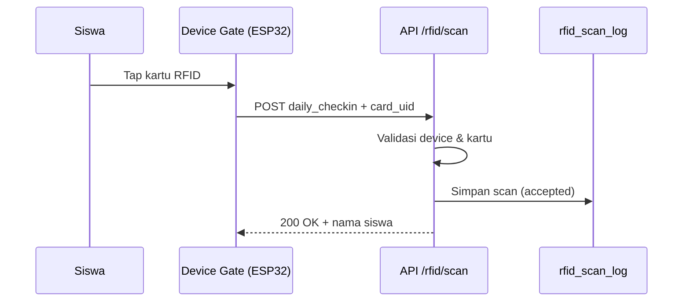
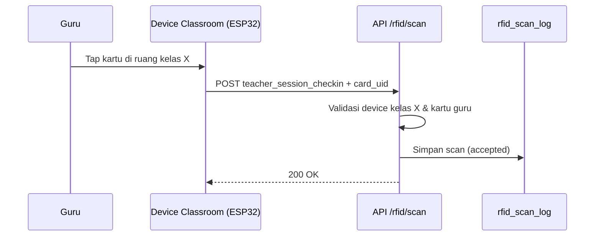

# Panduan Presensi RFID — Siswa & Guru

Dokumen ini menjelaskan cara kerja absensi RFID di EduCore LMS, konfigurasi perangkat di admin panel, serta implementasi firmware Arduino (ESP32 + MFRC522).

**Referensi kode:**
- Firmware ESP32: [`esp32_rfid_attendance_mfrc522.ino`](./esp32_rfid_attendance_mfrc522.ino)
- Firmware NodeMCU ESP8266: [`nodemcu_esp8266_rfid_attendance_mfrc522.ino`](./nodemcu_esp8266_rfid_attendance_mfrc522.ino)
- Admin konfigurasi: `client/src/module/lms/attendace/admin/config/AttendanceConfig.jsx`
- API scan: `POST /api/lms/attendance/rfid/scan`
- Skema database: `database/attendance_schema.sql`

---

## 1. Ringkasan Arsitektur

Sistem presensi RFID terdiri dari tiga lapisan:

```
[Kartu RFID] → [ESP32 + MFRC522] → [API LMS] → [Database attendance.*]
```

| Komponen | Fungsi |
|----------|--------|
| Kartu RFID | Menyimpan UID unik; di-mapping ke user (siswa/guru) di tabel `attendance.rfid_card` |
| Perangkat ESP32 | Membaca UID kartu, mengirim HTTP POST ke server |
| Server LMS | Memvalidasi device + kartu, mencatat scan ke `attendance.rfid_scan_log` |
| Policy & evaluasi | Menentukan aturan jam masuk/pulang; hasil akhir disimpan di `attendance.daily_attendance` |

---

## 2. Jenis Perangkat (Device Type)

Sistem mendukung **dua tipe perangkat**. Tipe ini menentukan **sumber scan** dan **aksi default** jika firmware tidak mengirim `scan_action`.

### 2.1 Device `gate` — Gerbang Sekolah

| Atribut | Nilai |
|---------|-------|
| `device_type` | `gate` |
| `class_id` | **Harus kosong** (`NULL`) |
| `scan_source` | `gate` |
| Lokasi tipikal | Pintu masuk utama, pintu keluar, gerbang parkir |

**Digunakan untuk absensi harian (daily attendance):**

| Pengguna | Aksi scan | Keterangan |
|----------|-----------|------------|
| Siswa | `daily_checkin` | Tap kartu saat masuk sekolah |
| Siswa | `daily_checkout` | Tap kartu saat pulang (jika fitur checkout aktif) |
| Guru | `daily_checkin` / `daily_checkout` | Kehadiran harian guru (policy `teacher_fixed_daily` atau `teacher_schedule_based`) |

**Default server:** Jika `scan_action` tidak dikirim, server otomatis memakai `daily_checkin`.

**Praktik lapangan:** Pasang **dua unit gate terpisah** (atau satu unit dengan konfigurasi berbeda):
- Gerbang masuk → set `SCAN_ACTION = "daily_checkin"`
- Gerbang keluar → set `SCAN_ACTION = "daily_checkout"`

### 2.2 Device `classroom` — Ruang Kelas

| Atribut | Nilai |
|---------|-------|
| `device_type` | `classroom` |
| `class_id` | **Wajib diisi** — diikat ke satu kelas (`a_class.id`) |
| `scan_source` | `classroom` |
| Lokasi tipikal | Di dalam ruang kelas tertentu |

**Digunakan untuk absensi sesi mengajar guru:**

| Pengguna | Aksi scan | Keterangan |
|----------|-----------|------------|
| Guru | `teacher_session_checkin` | Guru tap kartu saat mulai mengajar di kelas tersebut |
| Guru | `teacher_session_checkout` | Guru tap kartu saat selesai sesi |

**Default server:** Jika `scan_action` tidak dikirim, server otomatis memakai `teacher_session_checkin`.

**Catatan:** Device classroom **bukan** untuk absensi harian siswa per mata pelajaran. Siswa tetap diabsen harian lewat gerbang (`gate`). Device kelas melacak **kepatuhan guru** terhadap jadwal mengajar di kelas yang di-assign.

---

## 3. Alur Absensi per Peran

### 3.1 Siswa — Absensi Harian via Gerbang



1. Admin mengaktifkan fitur **Absensi Harian Siswa** (`student_daily_attendance`).
2. Siswa memiliki kartu terdaftar di `attendance.rfid_card` (bisa diisi lewat halaman Siswa → field No RFID).
3. Siswa tap kartu di gerbang masuk → device mengirim `scan_action: "daily_checkin"`.
4. (Opsional) Jika **Log Checkout Siswa** (`student_checkout_logging`) aktif, siswa tap lagi di gerbang keluar dengan `daily_checkout`.
5. Server mencatat waktu scan; evaluasi status (hadir/terlambat/absen) mengacu pada **policy siswa** (`student_fixed`) yang di-assign ke siswa/kelas/grade/homebase.

### 3.2 Guru — Absensi Harian via Gerbang

Mirip siswa, tetapi memakai policy guru:

| Policy type | Perilaku |
|-------------|----------|
| `teacher_fixed_daily` | Jam masuk/pulang tetap per hari (seperti siswa) |
| `teacher_schedule_based` | Kehadiran harian dievaluasi dari jadwal mengajar |

Fitur terkait: **Absensi Harian Guru** (`teacher_daily_attendance`).

Guru tap di device `gate` dengan `daily_checkin` / `daily_checkout`.

### 3.3 Guru — Absensi Sesi Kelas via Classroom



1. Admin mengaktifkan **Absensi Sesi Kelas Guru** (`teacher_class_session_attendance`).
2. Setiap kelas yang punya jadwal mengajar sebaiknya punya device `classroom` dengan `class_id` yang sesuai.
3. Guru tap saat mulai mengajar → `teacher_session_checkin`.
4. Guru tap saat selesai → `teacher_session_checkout`.
5. Hasil sesi dikaitkan ke `attendance.teacher_schedule_requirement` berdasarkan jadwal (`l_schedule_entry`).

---

## 4. Konfigurasi di Admin Panel

Buka **LMS → Konfigurasi Presensi RFID** (`AttendanceConfig`). Ada 5 tab:

### Tab 1 — Fitur

Aktifkan/nonaktifkan modul:

| Kode fitur | Label | Dampak |
|------------|-------|--------|
| `student_daily_attendance` | Absensi Harian Siswa | Scan gerbang siswa dicatat sebagai kehadiran harian |
| `student_checkout_logging` | Log Checkout Siswa | Scan pulang siswa (`daily_checkout`) diproses |
| `teacher_daily_attendance` | Absensi Harian Guru | Evaluasi kehadiran harian guru |
| `teacher_class_session_attendance` | Absensi Sesi Kelas Guru | Scan di device classroom untuk sesi mengajar |

### Tab 2 — Policy

Buat aturan jam kerja per role:

- **Siswa — Fixed** (`student_fixed`): jam check-in, toleransi terlambat, jam checkout, durasi minimal kehadiran per hari.
- **Guru — Schedule Based** (`teacher_schedule_based`): mengacu jadwal mengajar.
- **Guru — Fixed Daily** (`teacher_fixed_daily`): jam tetap seperti siswa.

Setiap policy punya **day rules** per hari (Senin–Sabtu).

### Tab 3 — Device RFID

Kelola perangkat fisik:

| Field | Keterangan |
|-------|------------|
| Code | Identifier unik, contoh: `RFID-GATE-HB-0008` atau `gate-utama-01` |
| Nama | Label tampilan, contoh: `Gerbang Utama 01` |
| Tipe | `gate` atau `classroom` |
| Kelas | Wajib jika tipe `classroom` |
| API Token | Rahasia untuk autentikasi device; bisa di-rotate |
| Status | Aktif/nonaktif |

**Setelah membuat device:**
1. Salin **Code** dan **API Token** ke firmware ESP32.
2. Token bisa di-rotate kapan saja; firmware harus di-update setelah rotate.

### Tab 4 — Assignment

Petakan policy ke target:

| Scope | Target |
|-------|--------|
| `user` | Satu siswa/guru tertentu |
| `class` | Semua siswa di satu kelas |
| `grade` | Semua siswa di satu tingkat |
| `homebase` | Seluruh satuan pendidikan |

### Tab 5 — Laporan

- **Siswa** — rekap harian kehadiran siswa
- **Guru** — rekap harian + sesi kelas guru
- **Scan Log** — log mentah semua scan RFID (accepted & rejected)

---

## 5. Pendaftaran Kartu RFID

Kartu harus terdaftar di `attendance.rfid_card` sebelum scan diterima.

### Siswa
- Halaman admin **Siswa** → field **No RFID**
- Atau import kelas dengan kolom No RFID

### Guru
- Halaman admin **Guru** → field **No RFID**
- Atau import guru dengan kolom `No RFID`

### Format UID
- Firmware contoh mengirim UID sebagai **string hex uppercase**, contoh: `A1B2C3D4`
- UID di database harus **persis sama** dengan yang dibaca reader
- Untuk mengetahui UID kartu baru: upload firmware contoh, buka Serial Monitor (115200 baud), tap kartu — UID akan tercetak

---

## 6. API Endpoint

### 6.1 Health Check

```
GET /api/lms/attendance/rfid/ping
```

Respons contoh:
```json
{
  "status": "success",
  "message": "RFID endpoint aktif.",
  "server_time_wib": "2026-06-29 08:30:00",
  "timezone": "Asia/Jakarta"
}
```

Gunakan endpoint ini untuk memastikan ESP32 bisa menjangkau server sebelum uji scan.

### 6.2 Scan Kartu

```
POST /api/lms/attendance/rfid/scan
Content-Type: application/json
```

**Body request:**

| Field | Wajib | Keterangan |
|-------|-------|------------|
| `device_code` | Ya | Code device dari admin panel |
| `device_token` | Ya | API token device |
| `card_uid` | Ya | UID kartu (hex uppercase) |
| `scan_action` | Tidak | Lihat tabel di bawah; default mengikuti tipe device |
| `scanned_at` | Tidak | Waktu scan ISO-8601 UTC, contoh: `2026-06-29T01:30:00Z` |

**Nilai `scan_action` yang valid:**

| Nilai | Device | Penggunaan |
|-------|--------|------------|
| `daily_checkin` | gate | Masuk sekolah |
| `daily_checkout` | gate | Pulang sekolah |
| `teacher_session_checkin` | classroom | Mulai sesi mengajar |
| `teacher_session_checkout` | classroom | Selesai sesi mengajar |

**Respons sukses (HTTP 200):**
```json
{
  "status": "success",
  "result_status": "accepted",
  "message": "Scan diterima untuk Budi Santoso.",
  "data": {
    "scan_log_id": 12345,
    "user_id": 101,
    "user_name": "Budi Santoso",
    "scan_action": "daily_checkin",
    "scan_source": "gate"
  }
}
```

**Respons gagal (HTTP 400/404):**

| `result_status` | Penyebab |
|-----------------|----------|
| `rejected` | Token salah, kartu tidak terdaftar |
| `device_inactive` | Device dinonaktifkan di admin |
| `card_inactive` | Kartu dinonaktifkan |
| `user_inactive` | Akun user tidak aktif |

Semua scan (termasuk yang ditolak) dicatat di `attendance.rfid_scan_log` untuk audit.

---

## 7. Implementasi Arduino (ESP32 + MFRC522)

Firmware referensi ada di [`esp32_rfid_attendance_mfrc522.ino`](./esp32_rfid_attendance_mfrc522.ino). File tersebut **tidak perlu diubah** di repository; salin ke folder sketch Arduino IDE Anda dan sesuaikan konstanta di bagian atas file.

### 7.1 Hardware yang Dibutuhkan

| Komponen | Spesifikasi |
|----------|-------------|
| Mikrokontroler | ESP32 DevKit V1 (atau kompatibel) |
| Reader RFID | MFRC522 (13.56 MHz) |
| Kartu/tag | MIFARE compatible |
| Power | 3.3V untuk MFRC522 (jangan 5V) |

### 7.2 Wiring (SPI default ESP32)

| MFRC522 | ESP32 |
|---------|-------|
| SDA (SS) | GPIO 5 |
| SCK | GPIO 18 |
| MOSI | GPIO 23 |
| MISO | GPIO 19 |
| RST | GPIO 22 |
| 3.3V | 3V3 |
| GND | GND |

### 7.3 Library Arduino IDE

Install melalui **Library Manager**:

1. `MFRC522` by GithubCommunity
2. `ArduinoJson` by Benoit Blanchon (v6+)
3. `WiFi` dan `HTTPClient` — bawaan ESP32 board package

**Board package:** `esp32` by Espressif Systems (via Board Manager).

### 7.4 Konstanta yang Harus Disesuaikan

Buka file `.ino` dan ubah bagian konfigurasi:

```cpp
const char* WIFI_SSID = "NAMA_WIFI_SEKOLAH";
const char* WIFI_PASS = "PASSWORD_WIFI";

// Ganti dengan IP/host server LMS Anda
const char* API_URL = "http://192.168.1.10:2310/api/lms/attendance/rfid/scan";

// Dari admin panel → tab Device RFID
const char* DEVICE_CODE = "RFID-GATE-HB-0008";
const char* DEVICE_TOKEN = "rfid_abc123...";  // token setelah create/rotate

// Sesuaikan dengan fungsi fisik perangkat ini
const char* SCAN_ACTION = "daily_checkin";
```

**Port default server LMS:** `2310` (development). Sesuaikan dengan environment production Anda.

### 7.5 Konfigurasi per Skenario Perangkat

Salin sketch yang sama untuk setiap unit fisik; **hanya ubah** `DEVICE_CODE`, `DEVICE_TOKEN`, dan `SCAN_ACTION`:

| Unit fisik | device_type (di admin) | SCAN_ACTION |
|------------|------------------------|-------------|
| Gerbang masuk depan | `gate` | `daily_checkin` |
| Gerbang keluar belakang | `gate` | `daily_checkout` |
| RFID Kelas 7A | `classroom` | `teacher_session_checkin` |
| RFID Kelas 7A (keluar) | `classroom` | `teacher_session_checkout` |

> **Tips:** Satu device admin = satu `DEVICE_CODE` unik. Jika gerbang masuk dan keluar adalah dua ESP32 terpisah, daftarkan keduanya di admin (masing-masing punya code & token sendiri).

### 7.6 Alur Program Firmware

```
setup()
  ├── connectWifi()
  ├── setupNtpUtc()        // sinkron waktu untuk field scanned_at
  └── mfrc522.PCD_Init()   // inisialisasi reader

loop()
  ├── deteksi kartu baru
  ├── baca UID → hex uppercase
  ├── anti-double scan (2.5 detik window)
  ├── POST JSON ke API
  └── cetak hasil ke Serial Monitor
```

**Anti-double scan:** Firmware mengabaikan tap ulang kartu yang sama dalam 2,5 detik untuk mencegah duplikasi.

**Format UID:** Byte UID dikonversi ke hex uppercase tanpa separator, contoh `04A1B2C3D4`.

### 7.7 Upload & Uji

1. Sambungkan ESP32 via USB.
2. Pilih board **ESP32 Dev Module**, port COM yang benar.
3. Upload sketch.
4. Buka **Serial Monitor** → baud **115200**.
5. Pastikan muncul `WiFi connected` dan `MFRC522 ready`.
6. Uji ping dulu dari browser/Postman ke server.
7. Tap kartu — harus muncul:
   ```
   [RFID] Card UID: 04A1B2C3D4
   [RFID] HTTP 200 | UID=04A1B2C3D4
   [RFID] Scan accepted.
   ```
8. Cek tab **Laporan → Scan Log** di admin panel.

### 7.8 Troubleshooting Firmware

| Gejala | Solusi |
|--------|--------|
| `WiFi tidak tersambung` | Cek SSID/password; pastikan ESP32 dalam jangkauan AP |
| `HTTP -1` atau timeout | Cek IP server; pastikan ESP32 dan server di jaringan sama |
| `HTTP 404` | `device_code` salah atau belum didaftarkan |
| `HTTP 400 rejected` | Token salah → rotate token di admin, update firmware |
| `HTTP 400 Kartu tidak terdaftar` | Daftarkan UID di admin Siswa/Guru |
| UID tidak terbaca | Cek wiring; MFRC522 harus 3.3V; jangan kabel terlalu panjang |
| Scan dobel | Normal — dedupe 2.5s; bisa naikkan `dedupeWindowMs` jika perlu |
| NTP belum sinkron | Scan tetap jalan; server pakai waktu server sebagai fallback |

---

## 8. Contoh Konfigurasi Sekolah Lengkap

### Langkah admin (sekali setup)

1. **Fitur** → aktifkan keempat fitur absensi.
2. **Policy** → buat:
   - `POL-SISWA-2026` (student_fixed) — masuk 06:30, terlambat >15 menit, pulang 14:00
   - `POL-GURU-FIXED` (teacher_fixed_daily)
   - `POL-GURU-JADWAL` (teacher_schedule_based)
3. **Assignment** → assign policy siswa ke `homebase`; policy guru sesuai kebutuhan.
4. **Device RFID** → daftarkan:
   - `gate-masuk-01` (gate)
   - `gate-keluar-01` (gate)
   - `class-7a-01` (classroom, kelas 7A)
   - `class-8b-01` (classroom, kelas 8B)
5. **Siswa/Guru** → isi No RFID sesuai UID kartu fisik.

### Langkah teknisi (per device)

| Device admin | File sketch | SCAN_ACTION |
|--------------|-------------|-------------|
| `gate-masuk-01` | `gate_masuk.ino` | `daily_checkin` |
| `gate-keluar-01` | `gate_keluar.ino` | `daily_checkout` |
| `class-7a-01` | `kelas_7a.ino` | `teacher_session_checkin` |

Upload, uji tap, verifikasi di Scan Log.

---

## 9. Model Data (Referensi)

### Tabel utama

```
attendance.rfid_device      → perangkat ESP32
attendance.rfid_card        → mapping UID → user
attendance.rfid_scan_log    → log setiap tap kartu
attendance.daily_attendance → rekap harian per user per tanggal
attendance.daily_attendance_event → event checkin/checkout
attendance.teacher_schedule_requirement → sesi mengajar guru
```

### Relasi scan → absensi

| Scan source | Scan action | Target data |
|-------------|-------------|-------------|
| `gate` | `daily_checkin` | `daily_attendance.checkin_at` |
| `gate` | `daily_checkout` | `daily_attendance.checkout_at` |
| `classroom` | `teacher_session_checkin` | `teacher_schedule_requirement.actual_checkin_at` |
| `classroom` | `teacher_session_checkout` | `teacher_schedule_requirement.actual_checkout_at` |

---

## 10. Checklist Sebelum Go-Live

- [ ] Semua device terdaftar di admin dan status **Aktif**
- [ ] API Token tersimpan aman di firmware (bukan di repo git)
- [ ] Setiap siswa & guru punya kartu RFID terdaftar dengan UID benar
- [ ] Policy dan assignment sudah sesuai struktur sekolah
- [ ] Fitur absensi yang dibutuhkan sudah diaktifkan
- [ ] Uji scan dari setiap device fisik → cek Scan Log
- [ ] Uji kartu tidak terdaftar → harus ditolak dengan pesan jelas
- [ ] Uji device nonaktif → harus ditolak
- [ ] WiFi sekolah stabil; pertimbangkan IP statis untuk server
- [ ] Serial Monitor bersih dari error saat simulasi beban (banyak tap berturut-turut)

---

## 11. FAQ

**Apakah satu kartu bisa dipakai siswa dan guru?**
Tidak disarankan. Satu UID di-mapping ke satu `user_id` di `rfid_card`.

**Apakah siswa perlu tap di device classroom?**
Tidak untuk absensi harian. Device classroom khusus pelacakan sesi guru.

**Apakah guru perlu tap di gerbang dan kelas?**
Bisa, tergantung fitur aktif: gerbang untuk kehadiran harian, kelas untuk kepatuhan per sesi mengajar.

**Bagaimana jika server mati?**
ESP32 akan mencetak `[RFID] Scan failed/rejected.` di Serial. Saat ini firmware belum menyimpan offline queue; tap harus diulang setelah server hidup.

**Bisakah HTTPS?**
Ya, ganti `API_URL` ke `https://...` jika server production memakai TLS. Pastikan sertifikat valid atau gunakan root CA yang dikenali ESP32.

---

*Dokumen ini dibuat berdasarkan implementasi di repository EduCore LMS per Juni 2026.*
